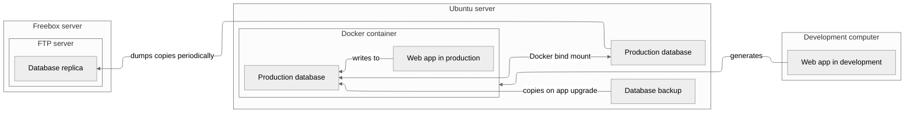

# verbatims-utn-vdl

A web app to display verbatims written on https://www.registre-dematerialise.fr/6058/.

Reach it online at http://verbatims-utn-vdl.webpil.ovh.

## Database save strategy

```mermaid
---
config:
  theme: neutral
  layout: elk
  elk:
    mergeEdges: true
    nodePlacementStrategy: SIMPLE
---
flowchart RL
 subgraph DevPlatform["Development computer"]
        Dev_app["Web app in development"]
  end
 subgraph Container["Docker container"]
        Container_db["Production database"]
        Production_app["Web app in production"]
  end
 subgraph Server["Ubuntu server"]
        Container
     Ubuntu_db["Production database"]
     Ubuntu_backup_db["Database backup"]
  end
 subgraph FTP["FTP server"]
        Freebox_db["Database replica"]
  end
 subgraph Freebox["Freebox server"]
        FTP
  end
    Production_app -- writes to --> Container_db
    Ubuntu_backup_db -- copies on app upgrade --> Container_db
    Ubuntu_db <-- Docker bind mount --> Container_db
    Ubuntu_db -- dumps copies periodically --> Freebox_db
    Dev_app -- generates --> Container
```